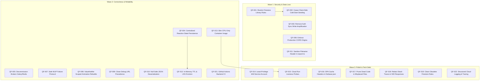

# Quantum Forge — Remediation and Implementation Plan

**Date:** 2026-10-08  
**Scope:** Staged Resolution of Audit Findings (`docs/AUDIT_REPORT.md`)  
**Methodology:** 3-Wave Prioritized Rollout with Strict Reversibility and Continuous Regression Testing  

---

## 1. Prioritised Fix List



---

### Wave 1: Security & Data Loss (Immediate — This Week)

#### Fix 1.1: Restrict Firestore Library Rules & Protect Public Templates (QF-001)
- **Effort:** Small (`S`)
- **Dependencies:** None (blocks QF-002)
- **Implementation Approach:** Update `quantum_forge/firestore.rules` so that `library/{templateId}` allows unrestricted `read` for everyone (including guests), but restricts `write` operations exclusively to requests authenticated with an administrator custom claim (`request.auth.token.admin == true`) or disables client write entirely. Deploy via `firebase deploy --only firestore:rules`.

#### Fix 1.2: Remove Client-Side Cold-Start Library Seeding (QF-002)
- **Effort:** Small (`S`)
- **Dependencies:** Requires QF-001
- **Implementation Approach:** In `quantum_forge/lib/main.dart`, remove the call to `unawaited(_seedLibrary())` from `initialiseCloudFeatures()`. Convert `autoSeedMedicalLibrary()` into an administrative CLI tool or offline maintenance script that runs with service account credentials, eliminating the 15 un-throttled batch document writes that execute on every user page load.

#### Fix 1.3: Eliminate Firestore Profile Sync Write Amplification (QF-003)
- **Effort:** Small (`S`)
- **Dependencies:** None
- **Implementation Approach:** In `quantum_forge/lib/core/services/firebase_auth_service.dart`, remove `unawaited(_syncUserProfile(user))` from inside `getUserId()` and `isAuthenticated()`. Keep profile synchronization strictly tied to `authStateChanges()` and explicit sign-in/sign-up events, and add a timestamp check so that returning user sessions synchronize their Firestore profile document at most once every 24 hours.

#### Fix 1.4: Enforce Production CORS Allowed Origins on Cloud Run (QF-006)
- **Effort:** Small (`S`)
- **Dependencies:** None
- **Implementation Approach:** Update the Cloud Run service environment variable `T1X_ALLOWED_ORIGINS` to remove the wildcard `*` and restrict allowed origins strictly to `https://quantom-forge.web.app,https://quantom-forge.firebaseapp.com`. Update local dev configurations to continue using regex matching on localhost/127.0.0.1.

#### Fix 1.5: Sanitize `reaction_id` in `export-ts` Filename Header (QF-011)
- **Effort:** Small (`S`)
- **Dependencies:** None
- **Implementation Approach:** In `tx1-fastapi-backend/main.py`, validate that `reaction_id` in `/reactions/{reaction_id}/export-ts` matches the standard UUID pattern (`^[0-9a-fA-F-]{36}$`) using regex or a Pydantic path parameter validator before embedding it into the `Content-Disposition` header, preventing header injection or response splitting attacks.

---

### Wave 2: Correctness & Reliability (Next 2 Weeks)

#### Fix 2.1: Implement Centralized Reaction State Persistence (QF-004) & Eviction (QF-012)
- **Effort:** Large (`L`)
- **Dependencies:** Wave 1 completion
- **Implementation Approach:** Replace the volatile in-memory dictionary `_reactions = {}` in `tx1-fastapi-backend/main.py` with an external persistent backing store. Write reaction progress, completion status, and attached DFT metadata directly to Firestore or a managed Redis cache. As a surgical interim step, wrap `_reactions` with an LRU cache capping retained reactions at 100 entries and auto-expiring completed reactions after 2 hours.

#### Fix 2.2: Decommission Inoperable Celery/Redis Endpoints on Cloud Run (QF-005)
- **Effort:** Medium (`M`)
- **Dependencies:** None
- **Implementation Approach:** Disable or remove `/simulate/hybrid-md`, `/simulate/status/{job_id}`, and `/simulate/download/{job_id}/{filename}` from `tx1-fastapi-backend/main.py` until a separate worker architecture (Cloud Tasks + Redis/MemoryStore) is provisioned. In the frontend, update `backend_compute_service.dart` to return an informative message ("Hybrid MD requires dedicated cluster resources") rather than failing on a connection refused 500 error.

#### Fix 2.3: Safe MLIP Failure and Transparency Protocol (QF-007)
- **Effort:** Medium (`M`)
- **Dependencies:** None
- **Implementation Approach:** Refactor `_eval_frame` and `predict_energy` in `tx1-fastapi-backend/main.py` so that if an evaluation fails mid-trajectory, it does not evaluate subsequent frames with a different fallback model. Either fail the trajectory with a clear descriptive message, or re-run the entire trajectory from frame 0 using the fallback model and return explicit flags (`fallback_used: true`, `fallback_reason: ...`) in the reaction metadata.

#### Fix 2.4: Optimize Reaction Animation Widget Rebuild Performance (QF-008)
- **Effort:** Medium (`M`)
- **Dependencies:** None
- **Implementation Approach:** In `quantum_forge/lib/core/widgets/reaction_animation_widget.dart` and its part files, extract the active frame index (`_frame`) out of `_ReactionAnimationWidgetState` into a standalone `ValueNotifier<int>`. Wrap the timeline slider, frame readout, and bond count widgets in targeted `ValueListenableBuilder` widgets. Remove `setState(() => _frame = clamped)` from `_showFrame`, preventing the top-level card and `NglViewer` from rebuilding on every frame tick.

#### Fix 2.5: Correct Debug URL Resolution Precedence in Frontend (QF-009)
- **Effort:** Small (`S`)
- **Dependencies:** None
- **Implementation Approach:** In `quantum_forge/lib/state/reaction_provider_backend.dart`, remove the condition `explicitOverride != kDefaultComputeBackendUrl`. In `AppSettings.effectiveBackendUrl()`, allow any explicitly configured non-empty URL to take precedence over the local loopback fallback in debug builds, allowing developers to test against the Cloud Run backend without hardcoding changes.

#### Fix 2.6: Harden JSON Deserialization with Null Safety (QF-010)
- **Effort:** Small (`S`)
- **Dependencies:** None
- **Implementation Approach:** In `quantum_forge/lib/features/reaction_runner/data/models/reaction_models.dart`, rewrite `ReactionStatusResponse.fromJson` to use null-safe casting with fallbacks (`json['reaction_id'] as String? ?? ''`, `parseState(json['state'] as String? ?? 'idle')`, `(json['progress'] as num?)?.toDouble() ?? 0.0`), preventing unhandled client crashes on malformed server payloads.

#### Fix 2.7: Build Slim CPU-Only Backend Container Image (QF-013)
- **Effort:** Medium (`M`)
- **Dependencies:** None
- **Implementation Approach:** In `tx1-fastapi-backend/Dockerfile`, modify the Python package installation to install PyTorch from the official CPU wheel index (`pip install --no-cache-dir torch>=2.0.0 --extra-index-url https://download.pytorch.org/whl/cpu`). Shrinks the Docker image from ~5 GB to under 1.5 GB, dramatically improving Artifact Registry storage costs and cold start container deployment times.

#### Fix 2.8: Add Backend CI Pipeline in GitHub Actions (QF-021)
- **Effort:** Medium (`M`)
- **Dependencies:** None
- **Implementation Approach:** Create `.github/workflows/backend.yml` to automatically run `ruff` linting, type checks, and `pytest test_main.py` on pull requests touching `tx1-fastapi-backend/`.

---

### Wave 3: Polish & Technical Debt (Backlog)

#### Fix 3.1: Provision Least-Privilege IAM Service Account for Cloud Run (QF-014)
- **Effort:** Small (`S`)
- **Dependencies:** None
- **Implementation Approach:** Create service account `quantom-forge-backend@quantom-forge.iam.gserviceaccount.com` without default Editor privileges. Bind only required roles and re-deploy Cloud Run with `--service-account`.

#### Fix 3.2: Configure Cloud Run Liveness and Readiness Probes (QF-015)
- **Effort:** Small (`S`)
- **Dependencies:** None
- **Implementation Approach:** Add HTTP liveness probes pointing to `/health` with `initialDelaySeconds: 15` and `periodSeconds: 30` to automatically recover from event loop deadlocks.

#### Fix 3.3: Configure SPA Cache-Control Headers in Firebase Hosting (QF-016)
- **Effort:** Small (`S`)
- **Dependencies:** None
- **Implementation Approach:** In `quantum_forge/firebase.json`, add a `headers` block configuring `Cache-Control: no-cache, no-store, must-revalidate` for `index.html`, `flutter_service_worker.js`, and `version.json`, while allowing long-term caching for hashed JS/WASM static chunks.

#### Fix 3.4: Redact Internal Stack Traces in Global 500 Middleware (QF-018)
- **Effort:** Small (`S`)
- **Dependencies:** None
- **Implementation Approach:** In `tx1-fastapi-backend/main.py`, catch unhandled exceptions, log the full traceback server-side, and return a sanitized response `{ "detail": "Internal server error. Reference ID: <trace_id>" }`.

#### Fix 3.5: Clean Repository Artifacts and Prune Dead Code (QF-017, QF-019, QF-020)
- **Effort:** Small (`S`)
- **Dependencies:** None
- **Implementation Approach:** Delete `quantum_forge/Dockerfile.save`, remove the unused function `_compute_single_frame` in `main.py`, and remove the unused `match /jobs/{jobId}` rule block in `firestore.rules`.

#### Fix 3.6: Configure Structured JSON Cloud Logging (QF-022)
- **Effort:** Medium (`M`)
- **Dependencies:** None
- **Implementation Approach:** Configure Python standard logging with Google Cloud JSON formatter exporting `severity`, `message`, `timestamp`, and `logging.googleapis.com/trace` headers.

---

## 2. Regression-Test Plan

### Post-Wave 1 Verification
1. **Firestore Rules:** Run `firebase emulators:exec "npm test"` or verify with curl:
   - Verify unauthenticated `GET` on `/library/<id>` returns 200 OK.
   - Verify unauthenticated `PUT` or `DELETE` on `/library/<id>` returns 403 Permission Denied.
2. **Quota Verification:** Reload the Flutter Web application 5 times in Chrome. Check Firestore console usage graphs to confirm write counts do not spike by 15 writes per reload.
3. **CORS Verification:**
   - Execute curl `OPTIONS` from `https://quantom-forge.web.app` (must return 200 with Allow-Origin header).
   - Execute curl `OPTIONS` from `https://unauthorized-domain.com` (must NOT return Allow-Origin header).
4. **Header Injection:** Send `GET /reactions/test%0D%0AInjected-Header%3Aevil/export-ts`; verify server rejects request with 422 or returns 404 without reflecting CRLF into headers.

### Post-Wave 2 Verification
1. **Reaction Animation Frame Rate:** Open Chrome DevTools Performance panel; start playback. Confirm CPU utilization drops and `buildCount` does not increment on frame ticks.
2. **Backend Fallback:** Trigger a prediction with a deliberately invalid element; confirm calculation returns a clean error or complete fallback without mixing potentials.
3. **Container Image Size:** Verify built Docker image is under 1.5 GB in Google Artifact Registry.

### Permanent Automated Tests to Add
1. **Backend Integration Suite:** Integration tests for `/predict`, `/reactions/submit`, `/reactions/{id}`, `/reactions/{id}/export-ts`, and `/reactions/{id}/attach-dft`.
2. **Flutter Widget Tests:** Add `testWidgets` for `AuthGate` ensuring offline and error state transitions; add tests for `DftWorkflowCard` ensuring error toasts display on 409 responses.

---

## 3. Rollback Plan

If any Wave 1 fix causes production degradation, execute the following surgical rollbacks:

### Reverting Firestore Rules (QF-001)
If legitimate client operations fail due to tightened security rules:
```bash
git checkout HEAD~1 -- quantum_forge/firestore.rules
firebase deploy --only firestore:rules
```

### Reverting Cloud Run CORS Configuration (QF-006)
If legitimate web origins are blocked:
```bash
gcloud run services update quantom-forge-gnn \
  --region us-central1 \
  --update-env-vars T1X_ALLOWED_ORIGINS="*"
```

### Reverting Cloud Run Revision (General Rollback)
If a new container revision introduces runtime regressions:
```bash
# Roll back traffic immediately to the previous healthy revision (e.g. quantom-forge-gnn-00004-5pl)
gcloud run services update-traffic quantom-forge-gnn \
  --region us-central1 \
  --to-revisions quantom-forge-gnn-00004-5pl=100
```
